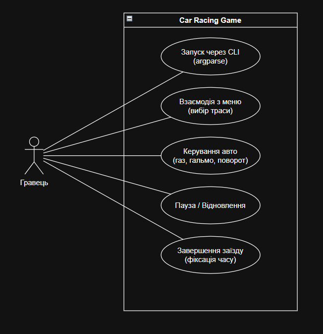

# Car_Racing-CI-CD

Цей репозиторій містить проєкт 2D гоночної гри з видом зверху (top-down), розроблений в рамках лабораторної роботи з дисципліни "Неперервна інтеграція та розгортання ПЗ". Гра розробляється на мові Python з використанням бібліотеки pygame. Це відповідає "складному рівню" реалізації.
Члени команди: Куценко Артур, Мороз Маргарита

## Етап 2: Аналіз гри та Варіанти Використання

### Опис гри та основні механіки
**Car Racing** — це класична аркадна гонка, де метою гравця є проходження треку за мінімальний час. 

**Ключові особливості та механіки:**
* **Фізика руху:** Автомобіль має інерцію, швидкість прискорення, гальмування та радіус повороту. 
* **Система колізій:** Гравець не може вільно виїжджати за межі траси. Зіткнення з узбіччям сповільнює або зупиняє авто (реалізовано через `pygame.Mask`).
* **Чекпоїнти:** Траса розбита на невидимі контрольні точки, щоб гравець не міг шахраювати (зрізати коло, поїхавши у зворотному напрямку).
* **CLI Налаштування:** Зміна складності керування або вибір карти здійснюється під час запуску гри через аргументи командного рядка за допомогою модуля `argparse`.

### Діаграма варіантів використання (Use Case)
Діаграма нижче описує основні сценарії взаємодії гравця (Актора) із системою.

* **Актор:** Гравець
* **Прецеденти:**
  1. Запуск гри через CLI з передачею аргументів (карта, колір).
  2. Взаємодія з головним меню.
  3. Керування автомобілем під час заїзду (газ, гальмо, поворот).
  4. Керування процесом (пауза/відновлення).
  5. Завершення заїзду (фіксація часу проходження).

  